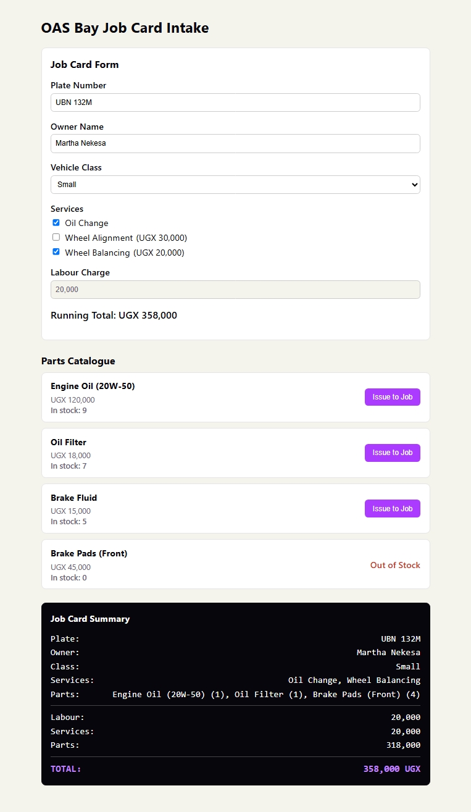

# OAS Bay Job Card Intake

### Name: Martha Nekesa

Week 1 Assignment — Vue 3 + Vite job card intake page for Oyera Auto Service Bay Ltd.

## How to run

```
npm install
npm run dev
```

Open http://localhost:5173

## Concepts used

- Vite project scaffolded and running
- 3 Single File Components: `JobCardForm.vue`, `PartCard.vue`, `ConfirmationCard.vue` (plus `App.vue`)
- `reactive()` for the job card and parts catalogue, `computed()` for the running total
- `v-model` on plate number, owner name, vehicle class, and service checkboxes
- `v-for` with `:key` over the services list and the parts catalogue
- `v-if` / `v-else` for "Issue to Job" vs "Out of Stock"
- Props passed from `App.vue` down to `JobCardForm`, `PartCard`, and `ConfirmationCard`
- `PartCard` emits `issue`, handled by the parent to reduce stock and update the total
- `onMounted` in `App.vue` logs "OAS Bay Intake loaded" and loads the parts catalogue
- Scoped CSS in `PartCard.vue` (and the other components)
- Labour charge is a read-only, disabled input fixed at 20,000
- Running total updates live via `{{ }}` interpolation

## Screenshot


