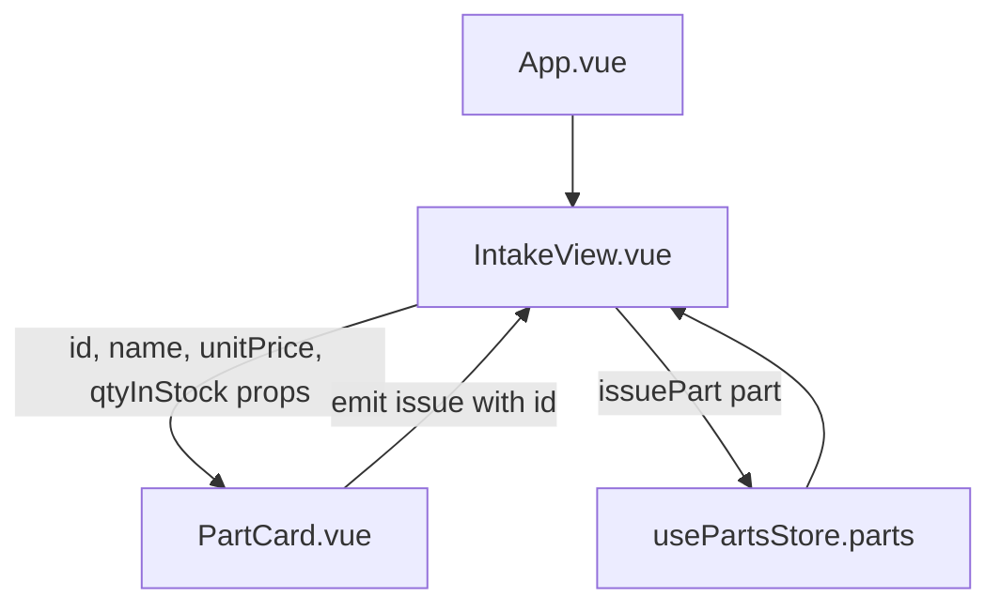
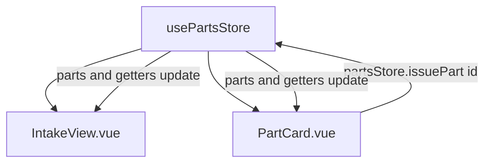

# OAS Bay Theory Answers

All references point to files and identifiers in this repository.

## Question 1: Reactivity

### a. Why the template does not update

`let count = 0` is a plain JavaScript variable. Vue only re-renders when a value it tracks changes. A plain `let` is not tracked, so `count++` mutates the number but never tells Vue to re-render.

In this project the equivalent working values are wrapped in reactive APIs. In `src/views/IntakeView.vue:35` the form model is `const job = reactive(createEmptyJob())`, and in `src/components/JobCardForm.vue:20` the touched map is `const touched = ref({ ... })`. Because these are reactive, `runningTotal` in `src/views/IntakeView.vue:48` and `errorCount` in `src/components/JobCardForm.vue:62` recompute and the DOM updates.

### b. Correct rewrite using the Composition API

```vue
<script setup>
import { ref } from 'vue'

const count = ref(0)

function increment() {
  count.value++
}
</script>

<template>
  <button @click="increment">Clicked {{ count }} times</button>
</template>
```

This is the same pattern used for `touched` in `src/components/JobCardForm.vue:20`, where the value is read and written through `.value` inside `setTouched`.

### c. Difference between ref and reactive

`ref()` wraps any single value (primitive or object) and is accessed with `.value` in script. It can be reassigned wholesale.

`reactive()` wraps an object or array only, is accessed with normal property access, and loses reactivity if the whole binding is replaced or destructured.

OAS Bay examples:
- `ref` is the better choice for `loading` and `error` in `src/stores/parts.js:6`, because each is a single flag that gets replaced (`this.loading = true`).
- `reactive` is the better choice for the `job` model in `src/views/IntakeView.vue:35`, because the form mutates many nested fields in place through `v-model` and `Object.assign(job, createEmptyJob())` resets it without breaking the binding.

## Question 2: Props vs Pinia

### a. Props flow from App to PartCard



`src/views/IntakeView.vue:118` passes the four props into `PartCard`. `src/components/PartCard.vue:12` emits `issue` with the part id, handled by `issuePart` in `src/views/IntakeView.vue:50`.

### b. Same components through a Pinia store



`src/stores/parts.js` holds `parts`, the `lowStockParts` and `outOfStockParts` getters, and the `issuePart` action. `RestockBanner.vue` reads `outOfStockParts` directly from the store with no props at all.

### c. When props are still the right choice

Props stay correct for a reusable presentational component that should not know about global state. `PartCard.vue` in this project takes `id, name, unitPrice, qtyInStock` as props (`src/components/PartCard.vue:2`). It renders one row and emits an event. Keeping it prop driven means it can be dropped into the intake page, a future parts admin page, or a test, without depending on `usePartsStore`. `ConfirmationCard.vue` is the same case: `src/views/IntakeView.vue` passes it the current job totals as props because they belong to that one screen.

## Question 3: Business Logic

### a. Computed property for the engine oil price

```js
const isEngineOilPriceValid = computed(() => {
  const value = Number(props.job.engineOilPrice)
  return value >= 79000 && value <= 200000
})
```

This is `src/components/JobCardForm.vue:33`.

### b. Where it is used and how it blocks submission

`isEngineOilPriceValid` is one term of `isFormValid` at `src/components/JobCardForm.vue:49`. The submit button is bound `:disabled="!isFormValid"` at `src/components/JobCardForm.vue:252`, and `submitJob` at `src/components/JobCardForm.vue:86` returns early when `isFormValid` is false, so the `submit-job` event never fires. A price of 50,000 keeps `isFormValid` false and the button stays disabled.

### c. Should the backend also validate

Yes. The frontend check is a user experience aid only. A user can call the API directly, disable JavaScript, or edit the request, so the browser is not a trust boundary. The same 79,000 to 200,000 rule must run server side in the `POST /api/jobs` handler before a job is stored. In this project that endpoint is mocked in `src/api/mock.js`, so the rule currently exists only client side.

## Question 4: Routing and Guards

### a. v-if on a RouterLink vs a beforeEach guard

`v-if="role === 'manager'"` on a `RouterLink` only removes the visible link. It is a user experience convenience.

A `beforeEach` guard runs on every navigation and can block or redirect. It is the security measure, because it still applies when the user types the URL directly.

In this project `src/App.vue:19` filters the nav links by role, and `src/router/index.js:25` enforces access.

### b. Guard that blocks a technician from /parts and /reports

```js
router.beforeEach((to) => {
  const userStore = useUserStore()
  const allowed = to.meta.roles
  if (allowed && !allowed.includes(userStore.role)) {
    return '/bays'
  }
})
```

This is `src/router/index.js:25`. `/parts` and `/reports` carry `meta: { roles: ['manager'] }` (`src/router/index.js:18` and `:19`), so a technician is redirected to `/bays`.

### c. How a technician still reaches /reports with only the link hidden

If only the nav link is removed and no guard exists, the route is still registered. The technician can type `/reports` in the address bar, use a bookmark, or refresh while on that URL, and the component renders. Hiding the link changes what is shown, not what is reachable.

## Question 5: Lifecycle and Async

### a. What onMounted does

`onMounted` registers a callback that runs after the component is inserted into the DOM. Template refs and rendered elements are available at that point.

Code at the top level of `<script setup>` runs during setup, before the first render. If a fetch there needs to read or update mounted DOM, or expects child components to exist, those are not ready yet. Data loading that only fills reactive state is fine either place, but `onMounted` is the predictable hook and is what `src/views/PartsView.vue:10` and `src/views/IntakeView.vue:86` use to call `partsStore.fetchParts()`.

### b. What `const data = fetch('/api/parts')` without await contains

`data` holds a pending `Promise`. `fetch` is asynchronous and returns immediately. Without `await` or `.then`, the code has the promise object, not the `Response`, and certainly not the parsed JSON. Reading `data.json()` would fail because a promise has no `json` method.

### c. The three request states and how each is handled

`src/stores/parts.js` models all three:
- Loading: `fetchParts` sets `this.loading = true` before the call (`src/stores/parts.js:18`).
- Success: `this.parts = await getParts()` fills state, then `finally` sets `loading` false.
- Error: the `catch` block sets `this.error = error.message` and the request does not throw out of the store.

`src/views/PartsView.vue` renders one of three branches: a spinner while `loading`, the error text plus a Retry button while `error` is set, otherwise the inventory table. `src/api/mock.js` rejects when `localStorage.getItem('oasApiFail')` is `'1'`, which is how the error branch is exercised.
